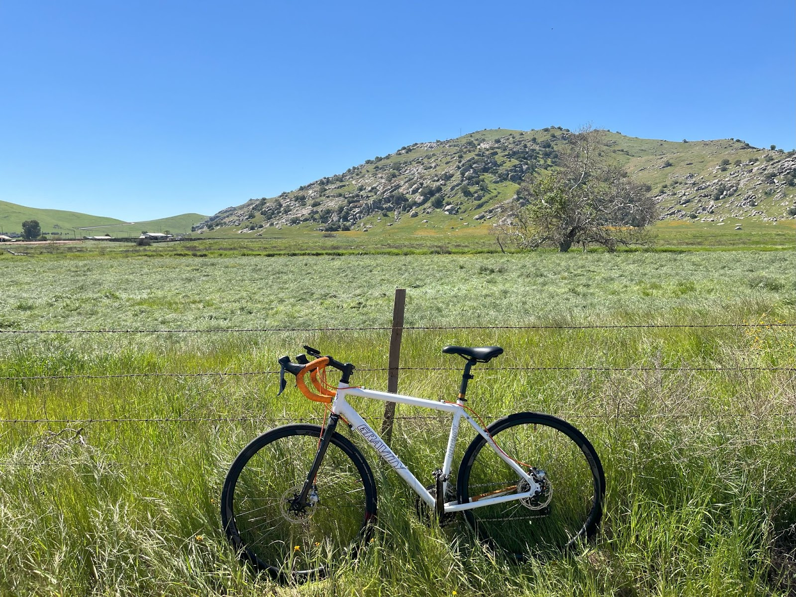

# From Cycling to Self-Hosting: Finding Freedom in the Journey

I am an avid cyclist. There’s nothing quite like the feeling of moving fast through beautiful countryside, smelling the lemon blossoms, spotting wildlife, and having the freedom to explore off the beaten path. The challenge of a big climb is exhilarating, and the sense of flying down the other side is pure joy. What I love most, though, is the sense of community—sharing rides with fellow cyclists as we challenge each other and revel in the adventure.

In recent years, electric bikes have become more affordable and capable, with longer ranges and the ability to handle all kinds of terrain. Initially, there were strong feelings within the cycling community that e-bikes somehow took away from the true experience of cycling, as they seemed to remove the physical challenge. But as I’ve seen more people out in the countryside, smiling as they experience the joy of riding, I’ve realized that e-bikes haven’t ruined cycling—they’ve made it more accessible. Now, more people can share in the freedom, speed, and beauty that cycling offers.

This post isn’t about cycling (though I could write a lot about that since I love it so much). Instead, I want to draw a parallel to another journey I’ve been on: self-hosting.

Much like cycling, self-hosting—running your own server to manage applications like email, file storage, home automation, and media streaming—offers a sense of freedom and control that’s incredibly liberating. But just as climbing a steep hill can be tough, setting up and maintaining a self-hosted system can be a daunting challenge, especially for those who aren’t familiar with networking, software, and all the jargon that comes with it.

Many self-hosters, much like experienced cyclists, take pride in the difficulty, learning new skills and feeling empowered by having complete control over their systems. But I believe self-hosting shouldn’t be reserved only for the technically elite. Everyone should have the opportunity to experience the benefits of digital autonomy, even if they don’t have the time or expertise to tackle every obstacle on their own.

This is where Tealok comes in. It’s the electric bike of self-hosting, offering the same sense of freedom and control but without the steep learning curve. With Tealok, you don’t have to put in all the hard work to reach a place of digital autonomy; the journey is made accessible, allowing everyday people to experience the joy of digital freedom.

Some self-hosting enthusiasts might worry that this approach waters down the experience, but just as e-bikes haven’t replaced traditional cycling, Tealok isn’t here to take away the challenge for those who want it. Instead, it aims to expand the journey, making the world of self-hosting accessible to everyone.

As you may have read in my previous posts, the digital world is becoming an increasingly polluted, restrictive, and congested place—a landscape dominated by business models that prioritize profit over people. The internet, once a vast and open space, has turned into a maze of walled gardens and subscription traps where we are locked into systems that often feel like digital extortion. The economic incentives driving big tech are so deeply entrenched that we can't expect them to offer a way out. Instead, we must find our own path to freedom.

The self-hosting community has long been the pioneers of this journey. Like experienced cyclists who chart new trails, they’ve built software and systems that serve the user, not the advertiser. This is the world Tealok seeks to open up for more people—a world where you’re in control, where you set the rules, and where your family can thrive in a safer, more creative digital environment.

Tealok isn’t just another product; it’s an invitation to join a movement that believes in reclaiming the internet as a space for genuine connection, productivity, and creativity. It’s a way to escape the digital traps set by big tech, to build something that belongs to you, and to experience the exhilaration of true digital freedom.

If this sounds like the kind of journey you want to be on, then join us. Whether you prefer the challenge of the uphill climb or the ease of an electric assist, there’s a place for everyone in this ride toward a better, more autonomous digital future.

