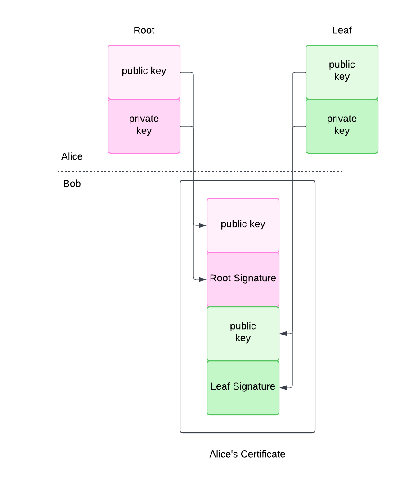

# Too Long, Didn’t Read

We have the means to change how the world works. We can get rid of passwords, password managers, strength tests, password recovery flows, account registration, data breaches, identity theft, and on and on. We can build something better and safer than passkeys. We can use personal certificate authorities.

# What?

When we deal with people, in person or via some kind of communication device, we need to be sure we are dealing with the person we expect. The process of determining that the other party is who they claim to be is authentication. In person this may be as simple as recognizing someone by their face or voice. Over a phone we may depend on the phone number of whoever is calling us. Different situations call for different levels of certainty, and therefore different mechanisms of authenticating the other person. If I’m just saying ‘hi’ to a neighbor I really don’t care to ensure they are who they claim to be. If I’m buying a house, I care very much.

Any given person has a single identity. They may have many personas: employee, proprietor, author, parent, child. For a particular relationship they may use a particular persona, and they may or may not want that persona tied to their identity. The ability of a person to act anonymously, or pseudonymously, is essential in modern society.

# Why?

Society is built on relationships between people. I do business with customers, I make and receive goods and services, I create friendships and families. Every life is a web of relationships. Each relationship is dependent on authenticating each party in the relationship to the other party in a relationship. Authentication, in some form or another, is happening constantly.

There’s lots of ways of communicating and lots of people. In this post I’m going to focus on communicating over the Internet. Specifically, how does Alice start a relationship with Bob and continue to prove that through time she is still Alice and Bob is still Bob?

# Baseline

We’ll start at the baseline - Alice and Bob have no system for authenticating with each other. Alice is therefore willing to believe that anyone claiming to be Bob is Bob, or that no one is. If Alice chooses to trust anyone it becomes easy for some attacker, Craig, to claim to be Bob and defraud Alice. Perhaps Craig accepts payment for a service and does not perform it. Perhaps Craig provides false information. If Alice chooses to trust no one, she cannot have any relationships online. No banking, no purchasing, no searching, no learning. No trust means no ability to get any benefit.

# Sharing a Secret

The most basic form of authentication is to share a secret. We generally think of them as significant words or phrases and call them ‘passwords’, though there may be other forms such as secret locations or secret behaviors.

When Alice and Bob want to establish a relationship they could share a secret, a password. For a moment, let’s imagine that Alice is a user and Bob operates a large web site that Alice wants to use.

In the web world, commonly Alice knows the password and Bob stores a salted hash of a password. This is because Bob likely has many users and his database of passwords is valuable to attackers, so he makes some attempts to protect it. If Bob stores the password in this way he doesn’t have a way to recover the password later. In theory, though, they both know the password because Alice sends it to Bob when their relationship is established via “user registration”.

When Alice registers her persona with Bob, she’s asked to pick a password. Since she has hundreds of personas across hundreds of websites that all operate exactly like Bob, she’s likely going to reuse one password across all of them.

This is bad because now Bob can use that password to impersonate Alice to any of the hundreds of websites she’s registered with. Bob may not know which websites those are, [but he can guess](https://xkcd.com/792/).

Friends don’t let friends pick passwords. Human memory is finite, so you’ll reuse passwords. The more you reuse a password, the greater the likelihood that it will be compromised and the larger the blast radius when it is. Computers have effectively infinite memory and are good about randomness, use them.

Always have a computer pick your password and save it.

# Account Recovery

Most service operators value their relationship with you more than they value the security of your identity. This is proven by how common the “password recovery” flow is in website operators. At the bottom of the password recovery flow is the ability to delegate authentication to some other entity.

This becomes clear with an example.

Alice establishes a relationship with Bob by registering on Bob’s website. During that flow, Bob asks for some additional information for account recovery: an email address. Now, anyone who can access Alice’s email can impersonate Alice. They just initiate the account recovery process and intercept the email. This could be some third party, or it could be the email provider themselves.

The more providers that do this, the more valuable access to Alice’s email becomes because her email account becomes the root of authentication for all of her personas.

# Passwordkeyfob

Passwords aren’t too bad when computers manage them. They do have a few weaknesses though. They can be copied. This is useful if many people want to legitimately impersonate Alice to Bob. If an attacker copies a password they can impersonate Alice and it’s impossible for Alice to know it’s happening.

Passwords can be really long, but they can be short. This means in many cases they can be written down or dictated by a person. This is handy for copying it without the help of a computer. You can even write it down and put it in a safe.

Of course, that means attackers can get it out of the safe.

Everything is a tradeoff.

If some attacker listens in on the authentication messages between Alice and Bob they can get the password. The attacker can then impersonate either party.

Cryptography is neat. With [Diffie-Hellman](https://en.wikipedia.org/wiki/Diffie%E2%80%93Hellman_key_exchange) Alice and Bob can share knowledge of a secret without transmitting the secret to each other directly. With [asymmetric crypto](https://en.wikipedia.org/wiki/Public-key_cryptography) Alice and Bob can directly provide each other with a public half of a key and use [a challenge-response](https://developer.mozilla.org/en-US/docs/Glossary/Challenge) protocol to authenticate themselves in a way that can’t be replayed. The crypto can be embedded in secure hardware that is extremely expensive to copy.

Some of these ideas have been put together into an idea called [passkeys](https://fidoalliance.org/passkeys/). A few technology companies have gotten together and created the [FIDO Alliance](https://fidoalliance.org/) to define standards for how passkeys work.. Passkeys as defined by the FIDO alliance have a number of problems:

* They are still working on a standard for [copying keys between providers](https://fidoalliance.org/fido-alliance-publishes-new-specifications-to-promote-user-choice-and-enhanced-ux-for-passkeys/).
* Some implementations are [limited to just a few dozen keys](https://support.yubico.com/hc/en-us/articles/360013790319-How-many-accounts-can-I-register-my-YubiKey-with).
* Some providers don’t support multiple (backup) keys and require keys to be locked to a single hardware device. This means if a single device is lost or broken, you lose the account.
* [‘Attestation’](https://developers.yubico.com/Passkeys/Passkey_relying_party_implementation_guidance/Attestation/) is the ability for a device to send information about itself to some third party. [Attestation is terrible](https://news.ycombinator.com/item?id=35861260). It allows some engineer at some company to force Alice into very specific authentication behavior, possibly contrary to how Alice wants to handle it.

To be clear, passkeys have some advantages we want. But we can do better than what the FIDO Alliance offers.

# Certificates and Authority

We want to keep most of the cryptography that passkeys offer. Specifically, we want [asymmetric crypto](https://en.wikipedia.org/wiki/Public-key_cryptography) in which Alice has a private key and a public key. She keeps the private key safe, and broadcasts the public key to anyone, including Bob. Bob uses the public key and some math to prove that Alice has the private key.

It’s entirely possible for Alice to use a single key pair with everyone, all the different online Bobs running all their different websites. She could copy the key between her devices so that she can authenticate herself from any of them. This is a bit dangerous, however. If she copies the key to a device and that device is stolen or compromised then all of her identities are all simultaneously compromised. That’s terrible for Alice.

We can do better.

Let’s introduce the idea of a chain of keys. In this chain we create a root key pair as before. We then create another key pair, which we’ll call the leaf key pair. The leaf key pair we intend to use just for the relationship between Alice and Bob, not Alice and anyone else. We then sign this leaf key with the root key. 

We combine the public half of the leaf key with the signature. This creates a certificate. Alice gives this certificate to Bob when establishing their relationship. Bob then saves this certificate. Any time Alice wants to authenticate with Bob, she signs what she sends Bob using the leaf key pair in the certificate. If she loses the leaf key, she can create a new one **and sign it with the same root key.**

Because Bob stored the certificate, he has a copy of the public half of the root key pair. He then knows that it’s still Alice, because it’s still her root key. She just wants to shift to a new key pair to sign requests. Bob doesn’t need to know why Alice switched keys. He just needs to know that it’s still Alice, and she has decided to switch, and that’s fine.

This is great! Now Alice can copy just the leaf key to any devices she wants to use to communicate with Bob, and only copy her root key pair on devices that she uses to create new keys.

We can do better still.

Alice’s root key is very valuable. It has the ability to authenticate Alice to any service she uses. We want it very well protected. The more protected we make it, the less convenient it is for Alice to use it. Alice doesn’t create new relationships every day, but she does create them fairly often. Any time she writes a new email to a new recipient, or signs up for something she’ll need that root key.

What if we introduce another key? An intermediate key, something between a root key and a leaf key. We can make the intermediate key just as powerful as the root key for signing, but add artificial limits for security. For example, the intermediate key only works for 24 hours. Then if someone steals a device they have just 24 hours to break in and use the key before its time limit expires.

All we have to do is create the intermediate key, sign it with the root key, then sign any leaf keys with the intermediate key. We then include all of these signatures in our certificate.

What I’ve just described is actually really common. It’s called [a certificate chain](https://knowledge.digicert.com/solution/how-certificate-chains-work), and it’s used by millions of websites around the world today in order to turn ‘http://’ into ‘https://’ and secure websites.

A certificate authority creates a key that serves as a “root”. This key is used to sign an intermediate key, then the root is put in cold offline storage for safety. The intermediate key is used to sign certificates for website operators after validating they own a given website. Eventually the website operator provides the signed certificate to web browsers. The chain of signatures is used by the browser to validate that the website is operated by the correct owner.

This system is powerful, allowing a consistent experience for users and flexibility for site operators.

This is the best authentication system we’ve engineered to date.

We can actually use this between Alice and Bob. It’s not restricted to working just between browsers and website operators.

When Alice and Bob establish their relationship they both provide each other with a root certificate. Any time they want to prove their identity with each other they provide a chain of certificates with the original root at the bottom. They can each decide what operational security to employ around their intermediate keys. It is sufficient for authentication that they verify that the chain is correct and the signatures valid.

The major reason we don’t use this system today is because it generally requires an expert engineer to create a certificate authority, generate certificate chains, and configure software to use them. This is not because the work is hard.  People who know how to do it can do the work in a couple of minutes. It is because there is no reason yet to make it easier. We generally expect that non-IT-professionals have no reason to use certificate authorities.

Something similar was said about TLS and secure certificates before [Let’s Encrypt](https://letsencrypt.org/). Then some smart people worked hard for years and now it runs the certificate authority powering 300 million websites for free using powerful automated software.

# New Powers

Within the [X.509 certificate standard](https://en.wikipedia.org/wiki/X.509) there are many optional capabilities. We can leverage these capabilities to give Alice new powers when authenticating. For example,[ X509v3 Subject Alternative Name](https://en.wikipedia.org/wiki/X.509#Sample_X.509_certificates) is used today by websites. It determines what websites can use a certificate. Without it, when a certificate authority signed a certificate for website A, that website could use the certificate claiming to be website B.

Alice can use something similar with her own certificates. Let’s say that Alice banks with First Trust bank. She has a new computer program, Peppermint, that she wants to use to organize her finances. Alice could create a new leaf certificate that authenticates her to First Trust bank and give that certificate to Peppermint. This would allow Peppermint to do everything that Alice can do with First Trust bank. But why take the risk? Alice doesn’t want Peppermint to make transactions with the bank or to really modify anything. Alice could use an X509 capability to create a new leaf certificate that is limited to just viewing transactions. She then gives that certificate to Peppermint. If Peppermint is operated by an attacker, or just badly programmed, now Alice is protected since the certificate she used is limited in its powers to act on her behalf.

X.509 has other capabilities we can use. For example, a single certificate can be signed by multiple keys. This is called “[cross-signing](https://www.ssltrust.com/blog/understanding-certificate-cross-signing)”. An organization can cross-sign certificate chains for people acting on behalf of the organization. When this is done, Alice’s leaf certificate both authenticates her as herself, and additionally identifies her as acting on behalf of, or with approval of, an organization.

Today many large organizations use a system called  [single sign-on](https://en.wikipedia.org/wiki/Single_sign-on). This separates the process of authentication from any given application. It’s useful to individuals because it means they can sign-on once and use many different programs. It’s useful to organizations because it gives them a single place to configure authentication. This makes it easy to update access control, add new users, and remove old users. Single sign-on is complex and requires applications to develop support for it, administrators to configure it, and when it works it does so by passing the user's web browser between different websites. It’s possible to do single sign-on outside a browser, but it is very difficult and very few programs implement it.

Instead of single sign-on, we could use the certificate system. I could get a 1-day limited certificate cross-signed by my employer that authenticates me as a valid employee. I then use that certificate to authenticate on any device, with any program. I can then access my work resources (email, files, etc) from any device I put the certificate on, rather than just my browser window on my work computer.

This can also work for families, couples, cooperatives, or any entity that wants to share an identity.

With a single certificate authority tied to my online identity I can prove that I control all of my online accounts - social media, discussion boards, technical support, etc. If I were famous (and I’m not) then I wouldn’t need [a pay-to-play blue checkmark](https://help.x.com/en/managing-your-account/about-x-verified-accounts) to prove I am who I say I am. I wouldn’t need individual applications or providers to create a system specific to their offering that “validates” who I am to other people. Anyone could check everything I do online for the same signature and know it’s always me, no matter what platform I’m on.

 I can even host a service that contains my contact information, signed by me. We’ll call that my “contact source-of-truth”. It can have my phone number, mailing address, email address, etc. When one of those things changes, I update my contact source-of-truth. Instead of telling a provider like Amazon my address when I register, I give them my contact source-of-truth. Amazon pulls my address from my source-of-truth any time they need to send me something. Instead of my contact list containing phone numbers and emails I carefully curate, it just contains certificate chains I’ve encountered in the past, and a URL. When I want to call a person, my phone pulls their latest phone number, checks the signature, and then makes the call.

Today application providers store credit card information and request money when we place an order. They store credit card numbers. If we want to cancel a subscription, we have to convince them to stop, or we have to contact our credit card companies to prevent payment. If we change cards we have to update the number with every service. We could instead use a certificate to sign authorization for funds. We no longer then have to give out credit card numbers, and they don’t have to store them. We can have an automated system send a certificate each month for subscriptions, but we control the system, so we can stop the subscription at any time.

Email today isn’t encrypted - any party between our computers and the computer of the recipient can read every email that goes through their hands. This is usually dozens of companies. We could encrypt email between everyone using these certificates. This would also make it easy to identify spam.

This works for any person-to-person communication: email, phone, text, video calls, etc.

[Estonia today uses smart cards to permit e-signing of government documents](https://en.wikipedia.org/wiki/E-Residency_of_Estonia). Eventually other governments could accept certificate-signed documents as authoritative and binding. Throw in some [zero-knowledge proofs](https://en.wikipedia.org/wiki/Zero-knowledge_proof) and you could do secure voting from anywhere. For banking you could do proof-of-funds. For [age-restricted commerce or compliance with Know Your Customer (KYC)](https://www.idmerit.com/age-restricted-commerce/#:~:text=Age%2Drestricted%20industries%20such%20as,regulation%20requirements%20is%20not%20enough.) laws you can prove compliance without giving out copies of sensitive government documents.

# Costs

A system like this can’t be built by a single party. Any time we want many software systems to work together we need to agree on the behavior and the data they share. The [Internet Engineering Task Force (IETF)](https://en.wikipedia.org/wiki/Internet_Engineering_Task_Force) is the standards organization responsible for describing software behavior of this sort. They use a [Request for Comments (RFC)](https://en.wikipedia.org/wiki/Request_for_Comments) process to come to consensus on new network behavior. The first step in this process is to produce a working implementation. From there, you create software that uses that implementation to communicate.

We’re going to build that implementation.

We’ll need customers and we’ll need partners.

You should [join us](https://tealok.tech/#subscribe).

# Out With the Old

We should build this. It will be hard, and complex, but we’ll gain enough powers that it’ll be worth it:

* No more passwords, strength tests, or minimum requirements
* No more data breaches, no more passwords to leak
* No more sharing passwords with partners or family members
* No more identity theft
* No more menial data entry during “registration”
* No more lists of accounts to update
* No more proprietary platforms for signing documents
* No more spam
* No more subscriptions you can’t cancel
* No more passing around government IDs
* No more checking for “unauthorized charges”
* No more curating contact lists

When we do, when this kind of system is widespread across providers and customers we can get rid of passwords, password managers, strength tests, password recovery flows, account registration, data breaches, identity theft, and on and on.

We should build this.

You should help.

