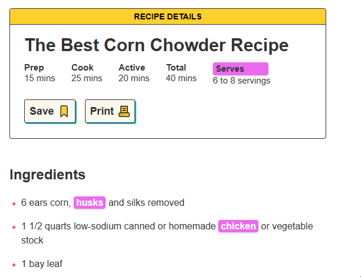
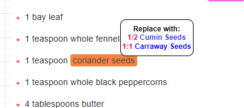
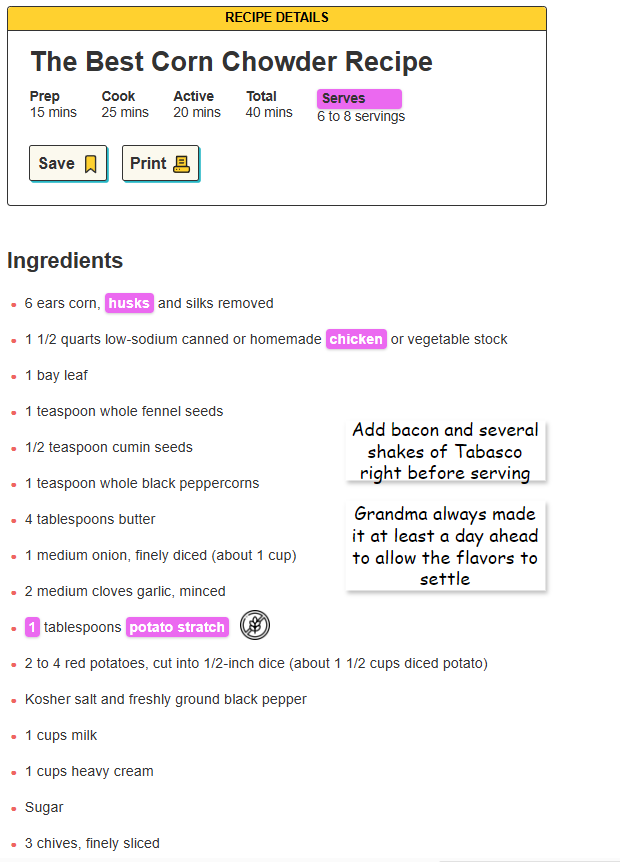

## Don’t Lose Your Appetite with Web Ads

Picture this: you're gearing up to recreate your grandmother’s legendary corn chowder for a family reunion. You start with a quick web search and land on what looks like the perfect recipe. But as you scroll, your enthusiasm falters—the page is plastered with intrusive ads, autoplaying videos, and distractions so vivid they dampen your appetite. Your kitchen adventure shifts to frustration, and before you know it, you’re grabbing takeout instead, setting the stage for a **life of sloth and mediocrity**. Tragic, isn’t it?

### A New Experience with Tealok

Now imagine a different start. You plug in your Tealok—your personal gateway to a better web. Instantly, its DNS sinkhole and transparent proxy activate, intercepting and blocking ads before they even have a chance to load. The recipe page now appears crisp and clean, free from clutter. Your focus returns to the dish at hand, unbothered by unwanted distractions.

### Beyond Ad-Blocking: The True Power of Customization

Tealok’s capabilities don’t stop at blocking ads. With its intelligent proxy and central data store, it transforms your browsing into a truly interactive and personalized experience. Picture this: you’re planning that potluck, and Tealok automatically identifies that the serving size isn’t enough. It offers you an option to double the recipe right on the page, updating it in real-time.

Here’s where Tealok takes customization even further:

* **Ingredient Tips**: As you scroll, Tealok reminds you to save the corn husks for your tamale recipe stored in its data bank.
* **Linked Recipes**: Tealok links your chicken stock recipe, displaying it as an option to include in your chowder.
* **Substitute Suggestions**: Missing ingredients? Tealok suggests suitable replacements and updates the list accordingly.
* **Personal Preferences**: Based on past choices, it highlights that you prefer red potatoes over russets and makes that suggestion.
* **Dietary Adjustments**: If you follow a gluten-free diet, Tealok automatically replaces flour with your go-to thickener.

And if inspiration strikes, you can annotate the recipe directly on the webpage. Tealok lets you edit any site as if it were a document, saving those edits for future visits or to share with family and friends.

### More Than Productivity—A Web That Works for You

Tealok isn't just about practicality; it's about transforming your relationship with the internet. Instead of fighting for focus amidst digital chaos, imagine a world where every click builds productivity, where your browsing is a seamless blend of inspiration and functionality.

Tealok’s self-hosted proxy and central data store make this possible by aligning with user-first incentives. Unlike conventional web tools that serve ads and mine data for shareholder profits, Tealok is built to enrich your life—keeping your data private and your experience uninterrupted.

### Customization and Control at Your Fingertips

With Tealok, customization isn't just an added feature—it’s the core experience. Turn your web into a canvas for innovation:

* **Editable Web Pages**: Treat any site like a word processor to add notes, modify layouts, or highlight key points.
* **Themed Browsing**: Want your web to feel like an old treasure map? Customize it.
* **Interactive Elements**: Embed quizzes, pop-up definitions, or links to your knowledge base on the fly.
* **Distraction-Free Mode**: Gray out non-essential sections and activate focus mode whenever you need.

### Automation and Smart Network Control

Tealok’s intelligent design adapts to your environment. Set automatic network adjustments, such as boosting bandwidth during movie nights or restricting social media during work hours. Imagine a browsing world that evolves based on your needs—offering personalized summaries, highlighting key information, and preloading cached enhancements for lightning-fast load times.

### The Underlying Magic: Why Tealok Stands Apart

At the heart of Tealok’s transformative power are its three key components:

1. **Self-Hosted Proxy**: Your customizable web gateway, offering unparalleled control over how pages appear and function.
2. **DNS Sinkhole**: An advanced filter that blocks unwanted domains and redirects traffic to user-preferred content.
3. **Central Data Store**: Your personalized data hub that enriches web interactions based on your stored notes, preferences, and needs.

This synergy creates an experience where the internet truly serves you—secure, private, and exactly how you envision it.

### The Future of Your Web: Connected, Productive, and Open

With Tealok, you’re not just a passive consumer; you’re the curator of your online world. The incentives are aligned to benefit you, fostering an experience that prioritizes enrichment over exploitation. Instead of building walls that separate users from value, Tealok builds bridges—connecting tools, data, and insights to make your web experience empowering.

Why settle for the default internet when you could have a web tailored to your life, flexible, creative, and awe-inspiring? With Tealok, the web becomes more than just a collection of sites—it becomes your personal domain, secure and limitless in its potential.
