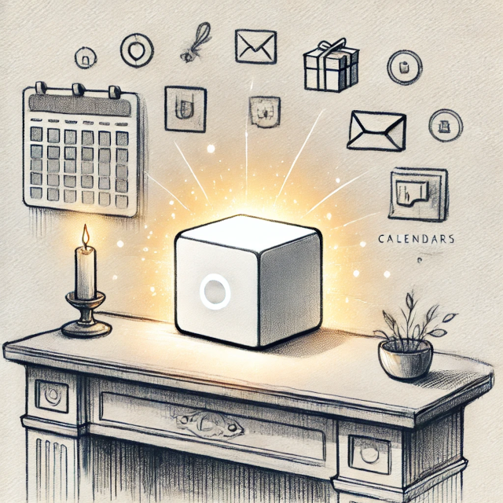

In today’s digital world, information is scattered across countless devices, apps, and cloud services, making it difficult to find what you need when you need it. You’ve likely experienced the frustration of searching for that one important document, photo, or message buried in a sea of files. Or perhaps you’ve worried about how to keep cherished memories—like family photos and videos—safe from disappearing into the void or being compromised by hackers.

This is where Tealok comes in, offering you a chance to own and control your entire digital environment. By having a single, secure place to manage your data, you gain:

* **Easier Organization:** Tealok makes it simple to locate documents, messages, and photos by centralizing everything in one place. No more endless searching through different apps or platforms.
* **Seamless Family Coordination:** Whether it's sharing calendars, photos, or notes, Tealok enables you to connect and coordinate effortlessly with family members or friends, enhancing communication and collaboration.
* **A Secure and Permanent Home for Your Memories:** Tealok provides a durable, private, and secure space to keep your most precious memories—photos, videos, letters, and more—safe from loss, theft, or accidental deletion. These memories won’t disappear, and you won’t have to worry about losing access due to shifting services or technology changes.
* **Complete Control and Privacy:** With Tealok, your data is stored on a device in your own home, meaning you’re the one in control. No one else can access, track, or monetize your personal information.

However, as powerful as this sounds, owning and managing your own system can seem daunting due to several challenges. The first challenge is the hardware. There are a number of decisions to make to get started, let alone planning to stay up-to-date and replacing things as they wear out. Once you get the hardware you have to configure routers, manage firewalls, IP addresses, and security. These technical hurdles can make it difficult of the anyone, even experts, to feel overwhelmed.

Once you’ve gotten a basic system set up you face the challenge of choosing software and configuring it. There are many software vendors out there, and not all applications are designed to work together seamlessly. You may end up manually transferring information between systems. It’s frustrating and inefficient.

1. 

# Tealok’s Solution: A Digital Hearth Designed for You

Tealok is built to overcome these challenges, providing an accessible and reliable way to enjoy the benefits of owning your own digital environment. Here’s how we make it happen:

**Simplified Networking:** Tealok can handle all the complexities of networking. It configures your router to make your data accessible from anywhere you are. As you tell your Tealok what you want it to do, it updates your network to keep you online and your data protected.

**Effortless Hardware Management:** The device that runs Tealok, which we call a *Lar*, is designed to be durable and easy to maintain. It runs quietly and efficiently in your home, requiring minimal effort on your part. Tealok manages updates, backups, and troubleshooting for you, so you can simply enjoy the benefits without dealing with the technical headaches.

**Unified and Interoperable Applications:** Instead of each application operating in isolation, Tealok provides a shared data environment. This allows all your apps to work together seamlessly, enabling a more cohesive digital experience. You can access your emails, photos, messages, and more—all from a single, integrated system.

# Delving Deeper: How Tealok Works

To truly appreciate how Tealok stands out, it’s important to understand some of the key concepts that make it unique:

* **What Is a Lar?** The Lar is the physical device that runs Tealok’s software. It’s the central hub that manages all your digital data and applications, just like how a hearth is the central gathering place of a home. The Lar is designed to be “set-it-and-forget-it,” quietly running in the background, always ready to serve your digital needs. If your needs grow, you can add more capacity to your Lar. If a Lar is damaged, it can be replaced, and your Tealok automatically restored from backup.
* **Tealok’s Software System:** The real magic happens with the Tealok software running on your Lar. This software is what makes it possible for you to manage, share, and interact with your digital data and applications without needing to understand the underlying complexities.
* **Tealok Applications:** The value of Tealok comes from the applications that run on it. These apps handle tasks like sending emails, storing photos, managing files, and even answering your queries. They work together in a shared data environment, allowing them to interact seamlessly.

**Special Applications: Lintel and Sekouri**

* **Lintel:** This is an application that comes pre-installed on every Lar. Lintel provides you with information about your Lar, its environment, and helps you install additional applications or manage their resources.
* **Sekouri:** Sekouri offers an "access hatch" to the deeper layers of your Lar. It allows technically inclined users or technicians to troubleshoot, modify, or even change how the Lar operates, giving you control if you want to dig deeper into the system.

**Our Approach: Building a Reliable, Secure, and Always-Available Digital Hearth**

Tealok is more than just a piece of technology; it's a complete system designed to be:

* **Durable:** Built to protect your data across hardware upgrades, failures, and vendor changes, ensuring your digital life remains consistent and intact.
* **Private:** Your data stays in your home, under your control, free from surveillance or external access.
* **Secure:** We prioritize security at every level, protecting your data from unauthorized access and breaches.
* **Networked:** Tealok ensures smooth communication between all your devices, acting as a reliable hub for your entire digital experience.
* **Always-Available:** With Tealok, your data is always accessible to you, whether you're at home or halfway around the world.

**Why Tealok Is Right for You**

Tealok was created to provide a better way to manage and control your digital life. By combining technical expertise with user-friendly design, we make it possible for anyone to enjoy the benefits of a personal, secure, and private digital space.

If you want to take back control of your digital environment and experience the advantages of having your own reliable, secure, and private system, Tealok is the solution you’ve been looking for.

